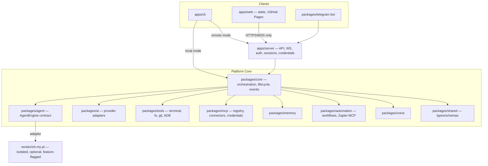

# PHOENIX — Product Requirements Document

| | |
|---|---|
| **Product** | PHOENIX |
| **Creator / Maintainer** | Umaiz Sufiyan |
| **Positioning** | Open-source AI agent platform for terminal, Android, and web |
| **Document status** | Draft v1.0 |
| **Last updated** | 2026-09-13 |

---

## 1. Executive Summary

PHOENIX is an open-source, cross-surface AI agent platform that gives a single user (or small self-hosted team) one continuous agent experience across a terminal CLI/TUI, a native Android/Termux environment with direct device control, and a browser-based chat workspace deployable to GitHub Pages. A self-hosted PHOENIX server owns all execution, provider credentials, sessions, and memory, so every thin client — web, CLI, Telegram — can attach safely without ever holding secrets itself.

PHOENIX is its own product and architecture, not a fork or rebrand of any upstream project. Internally, the platform's agent-execution loop is pluggable: a default adapter can delegate to the open-source **oh-my-pi** agent runtime through a narrow, isolated adapter layer (`packages/agent` → `vendor/oh-my-pi/`), but that engine is a replaceable implementation detail. PHOENIX's identity, protocol, memory model, permission system, tool surface, and distribution are independent of whichever engine is plugged in underneath.

## 2. Problem

- Developers today assemble AI coding/agent workflows from several disconnected tools — a terminal agent, a phone-automation app, a web chatbot — with no shared memory, no shared permission model, and no way to hand a task from one surface to another.
- Android automation from an AI agent commonly relies on privilege-escalation frameworks (e.g., Shizuku/Rish) that widen the attack surface and complicate distribution; a platform built on plain, direct ADB is comparatively rare and harder to get right end-to-end.
- Termux users are underserved by "real" package distribution — many "terminal AI agent" projects ship as install scripts or wrapper shims rather than actual `.deb` packages in a proper APT repository.
- Static-hosted (e.g., GitHub Pages) AI chat frontends frequently either fake server-side execution or leak provider API keys into the client bundle.
- The MCP ecosystem is growing quickly, but connector authentication, credential storage, and permission scoping are handled inconsistently — often bolted on per-tool rather than treated as a first-class subsystem.

## 3. Vision

**One agent, every surface, your keys, your machine.** PHOENIX unifies terminal, mobile, and web into a single continuous agent session with shared memory, shared tools, and a shared permission model — while remaining provider-neutral, engine-agnostic, and never trapping user secrets inside a static frontend.

## 4. Goals

| ID | Goal |
|---|---|
| G1 | Ship a real terminal CLI/TUI (`phoenix`) covering the full plan → build → review → test → debug loop, with subagent support. |
| G2 | Ship a self-hostable server (`apps/server`) that owns execution, sessions, streaming, and secrets, so any thin client can attach safely. |
| G3 | Ship a web client (`apps/web`) deployable as a static bundle to GitHub Pages that only ever talks to a user-controlled PHOENIX server. |
| G4 | Provide first-class Termux distribution via a real signed APT repository, not a wrapper script. |
| G5 | Provide direct-ADB Android device control with no third-party privilege-escalation framework. |
| G6 | Treat MCP as a first-class, secured subsystem: registry, connector lifecycle, credentials, permission scopes. |
| G7 | Provide a persistent, layered memory system shared across every surface. |
| G8 | Provide a multi-provider AI abstraction (Gemini, OpenAI-compatible, Anthropic, OpenRouter, and other supported providers) with streaming and tool calling as first-class primitives. |
| G9 | Support automation through native workflows and Zapier MCP. |
| G10 | Provide voice interaction and a Telegram bot as optional, pluggable surfaces. |
| G11 | Provide an extensibility system (`extensions/`) for first- and third-party additions. |
| G12 | Keep PHOENIX's architecture and identity independent of any single upstream agent engine. |

## 5. Non-Goals

- PHOENIX is not a consumer chatbot competing on model quality — it is provider-agnostic agent infrastructure plus a consistent UX across surfaces.
- PHOENIX will not introduce Shizuku, Rish, or any comparable privilege-escalation/relay framework for Android control.
- GitHub Pages will never host AI execution itself — it is a static frontend only; the server does the work.
- PHOENIX does not commit to any single upstream agent engine indefinitely; oh-my-pi (or any other engine) is optional and replaceable behind the adapter layer.
- A centrally hosted, multi-tenant PHOENIX SaaS is out of scope for this PRD; the supported model is self-hosting `apps/server`. A hosted offering would need its own PRD.
- PHOENIX does not redistribute any third-party AI provider's models or weights.

## 6. Target Users

- Terminal-first developers who want an open, inspectable, self-hostable coding agent.
- Termux/Android power users who want direct, transparent device control from an agent — no rooted-privilege side channels.
- Small teams who want a self-hosted, ChatGPT-style agent workspace running against their own provider keys.
- MCP and automation users who want GitHub, Supabase, Zapier, and custom MCP servers wired into one consistent agent, with real permission scoping.
- Contributors extending the platform through `extensions/`.

## 7. Product Principles

1. **Server-owned execution.** No secret, credential, or execution logic ever ships inside the static web frontend.
2. **Engine-agnostic core.** `packages/agent` defines the agent contract. Engines — including oh-my-pi — are adapters behind that contract, never load-bearing in PHOENIX's public API or product identity.
3. **One memory, every surface.** CLI, web, and Telegram read and write the same session/project memory through the server.
4. **Explicit permission over implicit trust.** Every terminal, filesystem, Git, ADB, and MCP action is scoped, and by default confirmable, before it executes.
5. **Real distribution over aliases.** Every documented install command must map to an artifact that actually exists and actually works.
6. **Provider neutrality.** No AI vendor is hardcoded anywhere in `packages/core` or `packages/agent`.

## 8. Architecture

### 8.1 Layering



### 8.2 Relationship to oh-my-pi

PHOENIX is an independent product and architecture. The default `packages/agent` implementation includes an adapter that can delegate step execution to the open-source **oh-my-pi** agent runtime (its published agent-runtime package, e.g. `@oh-my-pi/pi-agent-core` per oh-my-pi's current package layout). This integration is:

- **Isolated** — confined to `vendor/oh-my-pi/`, never imported directly outside `packages/agent`'s adapter module.
- **Optional and feature-flagged** — PHOENIX must define its `AgentEngine` contract such that a second, independent engine implementation could pass the same conformance tests (see §33).
- **Legally gated** — vendoring is only appropriate once oh-my-pi's current license and terms are confirmed compatible with PHOENIX's own license at integration time (see Appendix A). This PRD does not assert final license terms; that confirmation is an implementation-blocking prerequisite, not a formality.

PHOENIX must never be described in product copy, documentation, or UI as a fork, rebrand, or wrapper of oh-my-pi. oh-my-pi is, at most, one interchangeable execution engine behind PHOENIX's own architecture.

### 8.3 Dual-mode CLI

`apps/cli` must support two modes against the same `packages/core` execution path:

- **Local mode** — runs an embedded `packages/core` instance directly (no remote server required) for single-device, offline-friendly use.
- **Remote mode** — connects to a running `apps/server` instance, so CLI sessions share memory/state with web and Telegram surfaces.

## 9. Repository Structure

```
phoenix/
├── apps/
│   ├── cli/                    # PHOENIX CLI/TUI — `phoenix` binary
│   ├── server/                 # API, WebSocket/streaming, auth, sessions
│   └── web/                    # Browser client — static build for GitHub Pages
├── packages/
│   ├── core/                   # Orchestration, lifecycle, event system
│   ├── agent/                  # AgentEngine abstraction + oh-my-pi adapter
│   ├── ai/                     # Gemini, OpenAI-compatible, Anthropic, OpenRouter, ...
│   ├── tools/                  # Terminal, filesystem, Git, direct ADB
│   ├── mcp/                    # MCP registry, connectors, permissions, credentials
│   ├── memory/                 # Session/project/preferences/decisions/errors/long-term
│   ├── automation/             # Workflow engine + Zapier MCP integration
│   ├── voice/                  # Voice input/output
│   ├── telegram/               # Telegram bot integration
│   └── shared/                 # Shared types, schemas, utilities
├── extensions/                 # First- and third-party extensibility system
├── vendor/
│   └── oh-my-pi/                # Isolated upstream engine (optional, feature-flagged)
├── termux-build/                 # Termux .deb build scripts/tooling
├── apt-repo/                      # Hosted, signed APT repository for Termux distribution
├── docs/
└── .github/
```

> **Implementation-dependent:** exact monorepo tooling (e.g., pnpm workspaces + a task runner) is not fixed by this PRD and should be selected at repo bootstrap.

## 10. Core Modules

For each module: purpose, responsibilities, and explicit boundaries.

| Module | Purpose | Explicitly out of scope |
|---|---|---|
| `apps/cli` | Terminal CLI/TUI; local and remote modes | Owning provider credentials in remote mode (server does) |
| `apps/server` | API, WS/streaming, auth, sessions, credential storage, orchestration entrypoint | Any UI rendering |
| `apps/web` | Static browser workspace | Holding provider/MCP secrets; performing AI execution itself |
| `packages/core` | Session lifecycle, orchestration, event bus consumed by every app | Provider-specific or engine-specific logic |
| `packages/agent` | `AgentEngine` contract; default oh-my-pi adapter; agent "modes" (planner/builder/reviewer/tester/debugger); subagent orchestration | Direct provider API calls (delegates to `packages/ai`) |
| `packages/ai` | Uniform `ChatModel`/`CompletionModel` interface; per-provider adapters | Agent planning/tool-calling semantics (owned by `packages/agent`) |
| `packages/tools` | Terminal execution, filesystem ops, Git ops, direct ADB | Any privilege-escalation framework (Shizuku/Rish excluded by design) |
| `packages/mcp` | MCP client, server registry, connector lifecycle, credential vault, permission scopes | Automation scheduling (owned by `packages/automation`) |
| `packages/memory` | Session/project/preferences/decisions/errors/long-term memory API | UI rendering of memory (owned by `apps/web`) |
| `packages/automation` | Workflow definitions, triggers, Zapier MCP integration | Reimplementing individual app integrations Zapier already covers |
| `packages/voice` | STT/TTS interfaces and pluggable providers | Wake-word/always-listening background capture (not specified — treat as future scope) |
| `packages/telegram` | Bot adapter mapping Telegram chats to PHOENIX sessions | Bypassing the standard permission/memory model |
| `packages/shared` | Types, schemas, validation, event contracts used across the monorepo | Business logic |
| `extensions/` | Extension host contract and first-party example extensions | Shipping unreviewed third-party code by default |
| `vendor/oh-my-pi/` | Isolated, optional upstream engine source/build artifacts | Any direct consumption outside `packages/agent`'s adapter |

## 11. User Journeys

**J1 — Terminal developer, local mode**
Install via Termux/GitHub release → run `phoenix` → start a session → agent plans, edits files, runs tests, asks for confirmation on a destructive `git` operation → session and decisions persist to local memory.

**J2 — Web workspace, self-hosted server**
User deploys `apps/server` on their own machine/VPS → deploys `apps/web` to GitHub Pages (or opens it locally) → **Login → Connect to PHOENIX Server → Chat Workspace** → chats with streaming responses, uploads a file, switches model/provider mid-project, reviews tool activity and terminal output panels.

**J3 — Android/Termux with direct ADB**
User runs `phoenix` inside Termux → authorizes ADB (USB or wireless debugging, standard Android Developer Options flow) → asks the agent to inspect a companion device's logs or install a build → PHOENIX issues plain `adb` commands, each gated by the permission model.

**J4 — MCP connector setup**
From the web workspace's MCP settings, user adds a GitHub connector → authenticates → scopes it to a specific repository, read-only → agent can now open issues/PRs within that scope only.

**J5 — Automation via Zapier MCP**
User connects Zapier MCP as an automation connector → defines a workflow ("on new GitHub issue, notify Telegram") → PHOENIX's automation engine triggers the workflow through the same permission/credential model as any other MCP action.

**J6 — Remote control via Telegram**
User links a Telegram bot token in the web workspace's Telegram settings → messages the bot from their phone → the bot maps to the same session/memory the user was using in the web workspace.

## 12. CLI Requirements (`apps/cli`)

- Ships as a real, compiled/bundled `phoenix` binary/entrypoint — never a shell alias or wrapper around an unrelated tool.
- Supports local mode (embedded `packages/core`) and remote mode (connects to `apps/server`); mode is user-configurable.
- Streams agent output token-by-token in the terminal; supports safe cancellation of in-flight tool calls (e.g., Ctrl+C) without corrupting session state.
- Surfaces agent "modes" (plan/build/review/test/debug) and subagents as distinguishable panels/threads in the TUI.
- Persists local configuration (default server URL, default provider/model, local-only toggle) to a local config file.

> **Proposed, not finalized (implementation-dependent):** subcommand surface such as `phoenix chat`, `phoenix run <task>`, `phoenix session list|resume`, `phoenix mcp add|list|remove`, `phoenix config`, `phoenix doctor`. Exact command/flag names, the config file format (TOML/YAML/JSON), and the config file location must be finalized during CLI implementation — they are illustrative here, not a committed contract.
> **Implementation-dependent:** TUI rendering approach — a purpose-built PHOENIX TUI layer consuming `packages/core` events, optionally built on an existing terminal-UI rendering library — is not fixed by this PRD.

## 13. Web Requirements (`apps/web`)

- Builds to a static bundle with no server-side rendering and no build-time secret injection, so it can be deployed to GitHub Pages.
- Implements the authenticated flow **Login → Connect to PHOENIX Server → Chat Workspace**:
  - **Login** authenticates against a specific, user-supplied PHOENIX server instance (server URL entered or selected at runtime) — there is no centrally hosted PHOENIX account system by default.
  - **Connect** establishes the authenticated WebSocket/HTTPS session against that server.
  - **Chat Workspace** is the main authenticated view.
- Chat Workspace must provide:
  - ChatGPT-style conversation interface with streaming responses
  - Sidebar with chat history
  - Memory panel (session/project/preferences/decisions/errors/long-term, per §17)
  - File uploads
  - Voice button
  - Model/provider selector
  - MCP settings
  - Telegram settings
  - Automation settings
  - Server status indicator
  - Tool activity feed
  - Terminal output pane
  - Responsive mobile layout
- Must never embed provider API keys, MCP credentials, or long-lived server secrets in the client bundle; the server URL itself is runtime-configurable, not baked into the build, so one public Pages deployment can serve any self-hoster's server.

> **Implementation-dependent:** exact session-token storage mechanism (short-lived token in memory, refresh flow, or httpOnly cookie where deployment topology allows) is not fixed here; see §23 Security Model for the constraints it must satisfy.

## 14. Server Requirements (`apps/server`)

- Sole owner of: provider API keys, MCP connector credentials, Telegram bot tokens, Zapier auth, session persistence, and the orchestration entrypoint into `packages/core`.
- Exposes a versioned REST API for session/project/memory CRUD, MCP connector management, and auth, plus a real-time channel (WebSocket, or SSE — transport implementation-dependent) for streaming agent output, tool events, terminal output, and status.
- Must be self-hostable: as a Docker container, a bare Node process, or on-device under Termux for local-only setups.
- V1 target deployment is single-owner, self-hosted, with one or a small number of authenticated users; multi-tenant SaaS is explicitly out of scope (§5).
- Must explicitly configure allowed CORS origins for any web client (including a public GitHub Pages origin) that is meant to connect to it.

## 15. AI / Agent Requirements (`packages/ai`, `packages/agent`, `packages/core`)

**Multi-provider AI (`packages/ai`)**
- One internal `ChatModel`/`CompletionModel` interface; Gemini, OpenAI-compatible endpoints, Anthropic, OpenRouter, and other providers are implemented as adapters behind it.
- "OpenAI-compatible" covers OpenAI itself and any self-hosted/third-party endpoint implementing the same wire format.
- Provider/model selection is persisted per session and switchable mid-project from both CLI and web.

**Streaming**
- Token-level streaming from provider → server → client is a first-class requirement; no client-facing response path may be store-and-forward-only.

**Tool calling**
- `packages/agent` normalizes each provider's function/tool-calling schema into one internal tool-call representation consumed uniformly by `packages/tools` and `packages/mcp`.

**Planning, building, reviewing, testing, debugging agents**
- Modeled as named agent modes/roles (Planner, Builder, Reviewer, Tester, Debugger) sharing one underlying engine, differing in system prompt, allowed tool set, and exit criteria. Exact prompt content is a content-authoring task outside this PRD's scope.

**Subagents / team workflows**
- `packages/core` must support spawning scoped child sessions (subagents) with restricted tool/permission sets and a defined result-handoff contract back to the parent.
- Team workflows are multiple subagents coordinated by a parent/orchestrator agent, with partial-failure handling (§26).

**Engine adapter**
- The default `AgentEngine` adapter wraps the oh-my-pi runtime strictly through the contract defined in `packages/agent`; no other PHOENIX code may import oh-my-pi types directly (§8.2).

## 16. MCP Requirements (`packages/mcp`)

- MCP is a first-class subsystem: a registry of known/added MCP servers (GitHub, Supabase, custom servers, Zapier MCP, and others).
- Connector lifecycle: add → authenticate → scope permissions → enable/disable → remove, surfaced in the web workspace's MCP settings.
- Credential vault: encrypted at rest, server-side only; raw secrets are never sent to or stored in the web frontend bundle.
- Per-connector, per-action permission scoping (e.g., a GitHub connector scoped read-only to a specific repository).
- Custom MCP servers can be added by URL/config and are governed by the same credential and permission model as built-in connectors — no separate, weaker path for user-supplied servers.

## 17. Memory Requirements (`packages/memory`)

Layered memory model:

| Layer | Contents |
|---|---|
| Session | Current conversation/task state |
| Project | Per-repository/per-workspace facts |
| Preferences | User settings and style |
| Decisions | Recorded architectural/product decisions the agent should keep honoring |
| Errors | Recurring failure patterns to avoid repeating |
| Long-term | Durable facts persisting across sessions |

- Server-owned persistent store; exact database engine is implementation-dependent (e.g., SQLite for single-user self-host, Postgres for multi-user) and must be documented in `apps/server` configuration once chosen.
- Memory is transparent and user-editable — no hidden memory the user cannot inspect or delete — surfaced in the web workspace's memory panel.
- CLI and Telegram read/write the same memory store through `packages/memory`'s API; no surface keeps a local, unsynced memory silo.

## 18. ADB Requirements (`packages/tools`)

- PHOENIX communicates with Android devices **strictly through the standard `adb` protocol/binary** — USB debugging or wireless (ADB-over-network) debugging, using the device's own Developer Options authorization (RSA key pairing) exactly as any standard ADB client would.
- **Explicitly excluded, permanently:** Shizuku, Rish, or any comparable third-party privilege-escalation or relay framework. This must not be reintroduced via a default-bundled extension either.
- The ADB module exposes a constrained, permissioned command surface (shell command execution, file push/pull, package/activity management, and other operations natively supported by the standard ADB protocol) gated by the same confirmation model as other tools (§24). It must not attempt root-only operations by default.
- PHOENIX cannot and must not attempt to silently enable or bypass a device's own debugging-authorization step; the user must authorize the host's ADB key on-device.
- When PHOENIX runs inside Termux to control the same or a companion device, it still goes through the standard `adb` client/server — there is no special-cased, higher-privilege on-device path.

## 19. Voice Requirements (`packages/voice`)

- Input: microphone capture → speech-to-text, exposed as a voice button in the web workspace and as a CLI mode/flag.
- Output: opt-in text-to-speech playback of agent responses.
- `packages/voice` defines provider-agnostic STT/TTS interfaces; concrete engines (cloud or on-device) are pluggable and implementation-dependent, consistent with §7's provider-neutrality principle.
- Must degrade gracefully with no configured voice provider — voice controls are hidden/disabled, not broken.

## 20. Telegram Requirements (`packages/telegram`)

- Maps Telegram chats to PHOENIX sessions through `packages/core`, so a Telegram conversation shares the same memory as the web/CLI session it's linked to.
- Bot token entry and chat linking are managed in the web workspace's Telegram settings; the token is stored server-side only, never in the web bundle.
- Text conversation with streaming-equivalent updates (implemented as message edits, since Telegram's Bot API does not support true token-level streaming), file upload/download where Telegram's API supports it, and basic tool-activity notifications.
- Respects the same permission and confirmation model as every other surface — a chat-only surface does not bypass confirmations.

## 21. Automation / Zapier Requirements (`packages/automation`)

- Defines a workflow model: trigger → steps → actions, authorable by the user or proposed by the agent.
- Zapier MCP is the primary supported path into the broader Zapier app ecosystem, rather than PHOENIX reimplementing individual third-party integrations itself.
- Workflows can be triggered from a chat command, a schedule, or an inbound webhook received by `apps/server` (exact webhook ingestion mechanism implementation-dependent).
- Workflow execution reuses the MCP credential and permission model — there is no separate, less-audited automation-only credential path.

## 22. File Handling

- Uploads are accepted in the web workspace and, where the transport supports it, CLI and Telegram; storage backend is implementation-dependent (local disk by default for single-user self-host; pluggable object storage for larger deployments).
- Size and type limits are enforced server-side, not only client-side.
- Uploaded files become part of the owning session/project's memory context, subject to the same retrieval and inspection rules as other memory.
- Any agent action that operates on an uploaded file goes through the same `packages/tools` sandboxing and permission confirmation as any other tool call.

## 23. Security Model

- **Server-owned secrets.** Provider API keys, MCP credentials, Telegram bot tokens, and Zapier auth live only in `apps/server`'s credential store; never in the GitHub Pages web bundle.
- **Transport security.** HTTPS/WSS required for any non-localhost deployment; the web client refuses, or clearly and persistently warns on, plaintext HTTP/WS to a remote server.
- **Authentication.** Gates both web login and the CLI's remote-connect flow. Exact mechanism (password + session, token, OAuth) is implementation-dependent and must be finalized at server implementation time.
- **Authorization.** At minimum an "owner" role, with optional additional users each carrying scoped MCP/ADB/automation permissions.
- **Least privilege by default.** Every terminal, filesystem, Git, ADB, and MCP action is individually permissioned; first-time or high-risk actions require explicit confirmation by default.
- **Secrets at rest.** Encrypted storage for credentials; exact mechanism (OS keychain for CLI-local secrets, encrypted database column or secret manager server-side) is implementation-dependent.
- **Supply chain.** `vendor/oh-my-pi` and other third-party dependencies are pinned to specific versions; the vendored engine's license compatibility must be re-reviewed before each release (Appendix A).

## 24. Permissions

| Tool category | Read-only | Write | Destructive/irreversible |
|---|---|---|---|
| Terminal | Auto-allow (sandboxed) | Confirm once per session | Confirm every time |
| Filesystem | Auto-allow within project scope | Confirm once per session | Confirm every time |
| Git | Auto-allow (status/diff/log) | Confirm once per session | Confirm every time (force-push, reset --hard, etc.) |
| ADB | Auto-allow (read-only shell/log commands) | Confirm once per session | Confirm every time (uninstall, wipe, etc.) |
| MCP connector | Per connector's configured scope | Per connector's configured scope | Confirm every time |
| Automation/Zapier action | Per connector's configured scope | Per connector's configured scope | Confirm every time |

- Defaults above are a starting policy; per-project and per-session overrides must be supported.
- Every permissioned action is auditable in the web workspace's tool-activity panel and in CLI output.

## 25. Configuration

- **Server:** environment variables and/or a config file for provider keys, database connection, authentication settings, allowed CORS origins, and MCP connector definitions. File format (YAML/TOML/JSON) implementation-dependent.
- **CLI:** a local config file for default server URL, default provider/model, and local-only mode toggle. Exact path and format implementation-dependent.
- **Web:** server URL and provider/model choice are set at runtime by the user, never baked into the build.

## 26. API / WebSocket Principles

- REST for session/project/memory CRUD, MCP connector management, and auth; a real-time channel for streaming agent output, tool events, terminal output, and server status (WebSocket vs. SSE is implementation-dependent, but incremental partial output must be supported either way).
- Versioned API surface (e.g., `/api/v1/...`) so CLI, web, and Telegram adapters can evolve independently of server internals.
- Reconnect/resume: a dropped real-time connection should be able to resume an in-flight session without losing agent state; exact resume mechanism (sequence numbers, cursors) is implementation-dependent.
- One shared event schema, defined in `packages/shared`, consumed identically by every client.

## 27. Error Handling

- Structured error events — not just thrown exceptions — travel over the same real-time channel as normal events, using a stable error-code taxonomy defined in `packages/shared`.
- Provider errors (rate limits, auth failures, model unavailability) are surfaced distinctly from tool/execution errors and from MCP connector errors, so clients can react appropriately (offer a provider switch vs. a retry vs. a permission prompt).
- A failing subagent reports failure back to its parent session rather than silently terminating the whole session.
- CLI: a defined non-zero exit-code taxonomy for scripting. Web: inline error surfaces in the chat workspace and tool-activity panel — never silent failure.

## 28. Performance

- Streaming first-token latency and perceived responsiveness are prioritized over batch throughput for interactive chat.
- The server supports multiple concurrent sessions/subagents without one session's long-running tool call blocking another's.
- PHOENIX's performance requirement is about the platform's *added* overhead, not about outperforming the underlying AI provider's own latency. Numeric SLOs are to be defined during implementation and benchmarking, not asserted here.

## 29. Accessibility

- Web workspace: full keyboard navigability, screen-reader-compatible semantic markup for the chat transcript, sufficient color contrast, and respect for `prefers-reduced-motion`.
- CLI/TUI: usable without color (`--no-color` / `NO_COLOR` support) and without requiring more than a documented minimum terminal size.
- Voice input/output serves as an accessibility feature in addition to a convenience one.

## 30. Responsive Requirements

- The web workspace must remain usable on narrow mobile viewports: collapsible sidebar, touch-friendly tool-activity and terminal-output panels, and a one-handed-reachable voice button.
- No core workflow — login → connect → chat → tool activity → MCP/automation settings — may become unusable below common phone widths. Exact breakpoints are a frontend design task outside this PRD's scope.

## 31. GitHub Pages Deployment

- `apps/web` builds to a static bundle with no server-side rendering and no build-time secret injection.
- The target PHOENIX server URL is configured at runtime (first-run settings screen, query parameter, or local storage) — never hardcoded into the Pages build — so one public deployment can serve any self-hoster.
- `apps/server` must explicitly allow the Pages origin(s) it's meant to serve via CORS configuration; this is a documented, required server-side setup step, not automatic.
- The Pages deployment should ship with security headers/CSP appropriate to reduce XSS and token-theft risk, consistent with the client-side token handling constraints in §23.
- GitHub Pages is the frontend only. All AI execution happens through the PHOENIX server.

## 32. Termux Packaging & Distribution

- `termux-build/` produces a real `.deb` package using Termux's standard packaging tooling; exact base image/toolchain is pinned at implementation time.
- `apt-repo/` hosts a real, signed APT repository (proper `Release`/`Packages` metadata) that users add as a Termux package source.
- The `phoenix` binary installed by the package is the actual compiled/bundled CLI — never a shell alias or wrapper around an unrelated tool.

**Distribution summary**

| Target | Command | Status |
|---|---|---|
| Termux, self-hosted repo | Add the PHOENIX `apt-repo/` source once, then `pkg install phoenix` | Primary supported path |
| Termux, official community repo | `pkg install phoenix` with no repo add step | **Aspirational.** Requires PHOENIX being accepted into Termux's official package repository via their own contribution/review process — not guaranteed and not controlled by this project. Must not be advertised as available until actually merged upstream. |
| CLI binary | `phoenix` | Must be the real compiled entrypoint on every install path |
| PyPI | `pip install phoenix-cli` | **Not currently available.** `phoenix-cli` is already a registered, unrelated PyPI package (a "Phoenix Command Line Interface" data-ingestion tool, first published 2020). An alternative name (e.g. a more specific or namespaced identifier) must be selected and its availability reconfirmed at release time before this path is documented as shipped. |
| GitHub Releases | Prebuilt binaries/archives attached to tagged releases | Standard path, no naming-conflict risk identified |
| APT repository | Self-hosted, signed | Backing store for the Termux path above |

> This table must be re-verified before each release; name availability on third-party registries can change.

## 33. Testing Strategy

- **Unit tests** per package, including contract/conformance tests for the `AgentEngine` interface (so the oh-my-pi adapter — or any future engine — can be tested against the same suite) and the `ChatModel` interface (so any provider adapter is tested identically).
- **Integration tests:** `apps/server` API and real-time flows; MCP connector lifecycle against mocked connectors; the ADB module against an emulator or mock ADB server — never against real physical devices in CI.
- **End-to-end tests:** `apps/web` against a running `apps/server` instance, covering Login → Connect → Chat Workspace and the major settings panels.
- **CLI tests:** scripted command tests and, where feasible, snapshot/golden-output tests for TUI rendering.
- **Packaging tests:** Termux build verification in CI before anything is published to `apt-repo/`.
- **Security regression tests:** no tool/ADB/MCP action executes without its configured confirmation; no credential appears in the web bundle, client-side logs, or network responses to the browser.

## 34. Observability & Logging

- Structured, leveled server logs with credential redaction enforced at the logging layer itself, not left to each caller. Logging library implementation-dependent.
- The web workspace's tool-activity and terminal-output panels are themselves a user-facing observability surface, fed by the same event stream that feeds server logs.
- An optional local usage/observability dashboard is a candidate future feature, not a v1 hard requirement.
- No default telemetry leaves the user's deployment without explicit opt-in, consistent with PHOENIX's open-source, self-hosted principles.

## 35. Future Roadmap

- Pursue submission of the Termux package to the official community repository.
- Evaluate a separately-scoped hosted/managed PHOENIX server offering.
- Add further AI provider adapters as the ecosystem evolves.
- Expand `extensions/` into a browsable extension marketplace.
- Deepen subagent/team-workflow orchestration (persistent named subagent roles, cross-session team memory).
- Consider native automation integrations beyond Zapier MCP where real demand outweighs Zapier's existing coverage.

## 36. Acceptance Criteria

- A user can install and run `phoenix` from a real Termux package and from a GitHub release archive; both launch the same compiled CLI.
- A user can deploy `apps/server` and `apps/web` (to GitHub Pages) independently, and complete Login → Connect to PHOENIX Server → Chat Workspace end-to-end with no secret ever visible in the browser's network tab or bundle.
- Switching AI provider/model mid-session works without losing session memory.
- Token-level streaming is visible in both the CLI and the web workspace.
- A destructive Git, filesystem, or ADB action is blocked pending explicit confirmation in a fresh session.
- An ADB command succeeds only after standard on-device debugging authorization — no Shizuku/Rish component is present anywhere in the dependency tree.
- Adding, scoping, and removing an MCP connector (e.g., GitHub) works from the web workspace, and the connector's credential never appears in client-side storage or logs.
- A Zapier MCP-backed workflow triggers correctly from a defined trigger.
- A user can inspect and delete an item from each memory layer via the web workspace.
- A Telegram-linked session shares memory with its originating web/CLI session.
- All items in Appendix A are resolved (not merely acknowledged) before a 1.0 release.

## 37. Definition of Done

A feature or release is done when:

- It is implemented behind the interfaces defined in this PRD (`AgentEngine`, `ChatModel`, shared event schema) rather than bypassing them.
- Automated tests exist per §33 and pass in CI.
- No credential, key, or token is present in the web bundle, client logs, or any artifact published to `apt-repo/` or GitHub Releases.
- Any distribution command documented in README/docs/marketing maps to an artifact that has actually been published and verified installable (§32) — nothing marked "aspirational" in this PRD is presented as shipped.
- Any change touching secrets, ADB, or MCP credentials has had a security-focused review.
- Documentation and changelog are updated.
- Creator/maintainer attribution is correct and consistent (**Umaiz Sufiyan**) everywhere the project is credited.

---

## Appendix A — Open Verification Items

These items are implementation-blocking and must be resolved (not merely tracked) before the corresponding feature ships:

1. **oh-my-pi license and version pin.** Confirm oh-my-pi's current license terms and the exact upstream package/version to vendor before first integration into `vendor/oh-my-pi/`; re-confirm at each upgrade.
2. **PyPI package name.** `phoenix-cli` is already registered by an unrelated project. Select and verify an available alternative before publishing a `pip install` path.
3. **Termux official-repo submission.** Confirm feasibility and timeline with Termux's own contribution process before advertising a bare `pkg install phoenix` with no repo-add step.
4. **Monorepo tooling** (workspace/build-orchestration choice).
5. **Database engine** for `packages/memory` and session storage (single-user vs. multi-user default).
6. **Config file format** for server and CLI configuration.
7. **Authentication mechanism** for server login/CLI remote-connect.
8. **Real-time transport** choice (WebSocket vs. SSE).
9. **TUI rendering approach** for `apps/cli`.
10. **STT/TTS provider(s)** for `packages/voice`.

## Appendix B — Capability Coverage Map

| # | Capability | Primary section(s) |
|---|---|---|
| 1 | AI coding agent | §15 |
| 2 | Multi-provider AI | §15 |
| 3 | Streaming responses | §15, §26 |
| 4 | Tool calling | §15 |
| 5 | Plan/build/review/test/debug agents | §15 |
| 6 | Subagents/team workflows | §15 |
| 7 | Terminal and filesystem tools | §10, §24 |
| 8 | Git integration | §10, §24 |
| 9 | Direct Android ADB control | §18 |
| 10 | Termux integration | §32 |
| 11 | MCP connectors | §16 |
| 12 | Memory system | §17 |
| 13 | File uploads/attachments | §22 |
| 14 | Voice interaction | §19 |
| 15 | Telegram bot | §20 |
| 16 | Automation workflows | §21 |
| 17 | Web chatbot | §13 |
| 18 | CLI/TUI | §12 |
| 19 | Sessions and project context | §14, §17 |
| 20 | Extensions | §10 |
| 21 | Security and permissions | §23, §24 |
| 22 | Real-time server events | §14, §26 |
